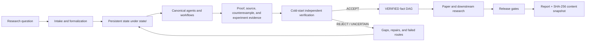
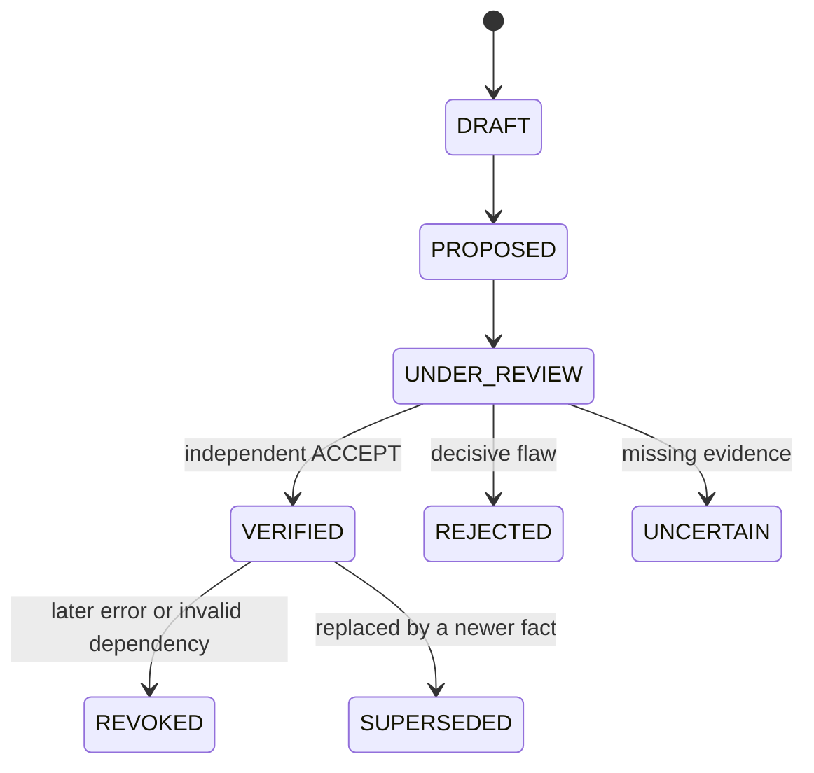

# ProofWeave

[繁體中文](README.md) | [简体中文](README.zh-CN.md) | [English](README.en.md) | [日本語](README.ja.md)

**Auditable mathematics research, woven from claims, evidence, and independent verification.**

[GitHub repository](https://github.com/f0909172434/proofweave-math-lab)

ProofWeave is a local, model-independent workspace for mathematical research, paper writing, and adversarial review. Its core is persistent files and deterministic gates—not chat history. It separates proofs, literature results, numerical evidence, conjectures, and open gaps, and records every model-routing decision without treating model agreement as truth.

## Start here: no coding experience required

You do not need to know Python, Git, JSON, LaTeX, or the command line. The easiest path is to open the entire project folder in an AI agent that can work with local files, then describe your mathematical question in ordinary language.

### 10-minute quick start (recommended)

1. Open the [ProofWeave GitHub page](https://github.com/f0909172434/proofweave-math-lab), choose **Code → Download ZIP**, or use the [direct ZIP download](https://github.com/f0909172434/proofweave-math-lab/archive/refs/heads/main.zip).
2. Extract the ZIP. Do not work inside the compressed file.
3. In your AI research agent, choose **Open folder** and select the extracted `proofweave-math-lab` folder. Open the whole folder, not only this README. If needed, see the official [ChatGPT and Codex quickstart](https://learn.chatgpt.com/docs/quickstart.md).
4. Paste the prompt below and replace the text in brackets with your question.

```text
I am using ProofWeave for the first time and I do not know how to code.
Do not ask me to use a terminal, write code, or edit JSON by hand.

Read AGENTS.md, workflows/00_project_intake.md, and
workflows/01_problem_formalization.md completely. Help me start a new
mathematics research project.

My research question is:
[Write your question here. It may be incomplete.]

Ask only one short question at a time and explain in plain language why the
information is needed. You are responsible for updating state/problem.md,
state/assumptions.md, state/notation.md, state/research_plan.md, and the other
required state files. Do not attempt a proof yet. Do not turn a conjecture,
numerical result, or model consensus into a theorem.

When intake is complete, restate the formal question in plain language, list
the assumptions and notation, mark every uncertainty as OPEN GAP, recommend
the next safe step, and run the available project checks. Do not use a paid
API, upload data, or publish anything without asking me first.
```

Answer the agent's questions. “I don't know” is a valid answer: the uncertainty should be recorded instead of guessed. The first session should leave a plain-language problem statement, explicit domains and assumptions, a Definition of Done, an `OPEN GAP` list, and one safe next action in the `state/` folder.

## Copy-ready prompts for common tasks

| Goal | Prompt |
| --- | --- |
| Check progress | `Read state/STATUS.md, state/open_gaps.md, and state/research_plan.md. Explain in plain language what is established, what remains unknown, and the next step.` |
| Map literature | `Follow workflows/02_literature_review.md. Verify original sources and distinguish opened evidence from search leads.` |
| Generate approaches | `Follow workflows/03_idea_swarm.md. Propose 3–5 genuinely different routes, each with its main obstacle, smallest test, and stop condition.` |
| Attempt a proof | `Follow workflows/04_proof_search.md for the smallest precise claim. Keep gaps UNCERTAIN and do not self-declare VERIFIED.` |
| Search for a counterexample | `Follow workflows/05_counterexample_search.md. Test endpoints, degenerate cases, and small dimensions first. Treat finite computation only as evidence.` |
| Run an experiment | `Follow workflows/07_computational_experiment.md. Save configuration, code, data, figures, and limitations, and label the result as evidence rather than proof.` |
| Review a paper | `Follow workflows/11_full_paper_review.md. Separate fatal, major, and minor issues, and identify decisions that still require a human expert.` |
| Save a handoff | `Follow workflows/14_session_handoff.md. Update status, decisions, open gaps, and failed routes so another session can continue.` |

## Four things every new user should know

1. `VERIFIED` is a project workflow status, not universal mathematical certainty or human peer review.
2. Numerical agreement is evidence, not proof—even after a very large computation.
3. Failure to find a counterexample is not a proof. Use `PROPOSED`, `UNCERTAIN`, and `OPEN GAP` honestly.
4. Research state lives in the project files. Back up the whole folder, and do not upload private research to a public repository.

## Beginner file map

| Location | Purpose |
| --- | --- |
| `state/problem.md` | Current research question and exact target |
| `state/assumptions.md` | Assumptions, restrictions, and consistency concerns |
| `state/notation.md` | Symbols, domains, and notation conventions |
| `state/research_plan.md` | Steps, risks, stop conditions, and Definition of Done |
| `state/STATUS.md` | Current progress summary |
| `state/open_gaps.md` | Unresolved or unverified questions |
| `state/dead_ends.md` | Failed routes preserved to prevent repeated work |
| `state/fact_graph.jsonl` | Formal claims and dependencies |
| `literature/`, `experiments/`, `paper/` | Sources, reproducible computations, and manuscript files |

## Common problems

- **The agent cannot find the project:** open the folder that directly contains `AGENTS.md`, `state/`, and `workflows/`, not the ZIP or a single file.
- **The agent requests an API key or payment:** say, “Stay in local native mode. Do not enable external APIs or paid calls.”
- **You see an unfamiliar error:** paste the complete error to the agent and ask it to diagnose and fix the project directly instead of only giving you commands.
- **A claim is called proven:** ask for its fact ID, assumptions, proof artifact, independent verification report, and dependencies. Missing items mean it should remain `PROPOSED` or `UNCERTAIN`.
- **Work exists only in chat:** ask the agent to run the session handoff workflow. Chat-only work is not durable project state.

## What ProofWeave can do

ProofWeave is not a black box that guarantees a correct proof from a prompt. It is auditable research infrastructure for structured collaboration between human researchers and AI agents.

| Research task | Support provided | Main artifact |
| --- | --- | --- |
| Problem formalization | Makes domains, quantifiers, assumptions, notation, boundary conditions, and completion criteria explicit | Intake files under `state/` |
| Literature review | Separates search leads, opened originals, and verified claim-level support | Source registry and `literature/` |
| Strategy generation | Develops genuinely different proof, obstruction, toy-model, and computational routes | Research plan and worker artifacts |
| Proof search | Decomposes problems into local claims and records dependencies, attempts, gaps, and repairs | `PROPOSED` claim packets |
| Counterexample search | Tests endpoints, degeneracies, small dimensions, and parameter limits first | Counterexamples, refutations, or bounded-search reports |
| Independent verification | Uses a cold-start verifier and a programmatic promotion gate | `ACCEPT`, `REJECT`, or `UNCERTAIN` reports |
| Reproducible experiments | Preserves configuration, environment, code, raw data, output, error analysis, and reproduction commands | Complete packages under `experiments/` |
| Formalization planning | Supports Lean feasibility and build records without claiming machine verification prematurely | Formalization plans or build artifacts |
| Paper writing and review | Writes from a frozen verified graph, maps LaTeX claims to facts, and audits global consistency | `paper/`, claim map, and issue ledger |
| Model and budget routing | Detects host capabilities and recommends auditable routes based on risk, tools, independence, and cost | Inventory, routing log, and budget state |
| Release validation | Checks structure, schemas, facts, sources, experiments, paper bindings, tests, secrets, and builds | Release report and content-hash snapshot |

## How it works



Chat output is not the truth layer. Research state must be written to files, and a formal claim can become a dependency only after independent verification and deterministic consistency checks.

### Claim lifecycle



The author cannot verify the same claim. Only an independent `theorem_verifier` can promote it. Formal dependencies must be `VERIFIED` and acyclic. Revocation audits every transitive descendant and affected paper or experiment location.

## Core technical design

| Component | Implementation and purpose |
| --- | --- |
| Runtime | Python 3.11+; the core runtime uses only the standard library |
| Persistent data | Human-readable Markdown, JSON, JSONL, YAML, and LaTeX files |
| Validation | 12 JSON Schema Draft 2020-12 schemas for facts, sources, experiments, models, routing, and reviews |
| Truth layer | Cycle-safe fact DAG with VERIFIED-only dependencies and transitive revocation |
| Source layer | `FOUND → OPENED → VERIFIED` states with exact supported claims and reviewer identity |
| Agent layer | 28 canonical roles, 18 workflows, 14 prompts, and generated Codex/Claude adapters |
| Routing | MODE A–E capability classification with availability, privacy, tool, independence, and cost filters |
| Experiment gate | Validates config, scripts, reports, artifact paths, and executable reproduction commands |
| Paper gate | Binds LaTeX claims to current verified facts using statement hashes and independent attestations |
| Release gate | Runs 72 automated tests plus structure, schema, graph, source, experiment, paper, secret, and optional PDF checks |
| Reproducibility | Produces a per-file hash manifest and SHA-256 snapshot ID for each successful release |
| Optional tooling | Supports `pdflatex` and Lean when available; missing tools are never reported as executed |

## Capability boundaries

- Workflow enforcement reduces risk but cannot guarantee that AI or humans made no mathematical error.
- `VERIFIED` is a project status, not journal peer review, formal proof, or absolute truth.
- Literature search depends on available browsing or database tools; search snippets are not verified sources.
- Lean, LaTeX, external models, and paid APIs are optional. Detection is not authorization.
- Routing selects policy-compliant execution; reputation, voting, and confidence never replace proof.

## What is implemented

- a fact DAG with cycle prevention and VERIFIED-only formal dependencies;
- cold-start, independent-verifier-only promotion;
- transitive revocation cascades and impact metadata;
- a validated source registry and revision issue ledger;
- experiment, bibliography, LaTeX claim-map, and secret checks;
- passive host/provider/model detection with MODE A–E classification;
- deterministic task, reasoning, model, fallback, and budget routing;
- a benchmark harness that refuses live/paid calls and fake rankings by default;
- 28 canonical roles, 18 workflows, 14 prompts, 12 schemas, and native Codex/Claude adapters that point back to the canonical files;
- an isolated odd-sum proof workflow and six dry routing demonstrations;
- a standard-library Python CLI and automated tests.

`VERIFIED` is a project workflow status. It is not human peer review or formal certainty. Lean support is optional and counts as machine-checked only after a pinned build with no disallowed `sorry`, `admit`, or unexpected axioms—and a human still checks that the formal statement matches the intended theorem.

## Optional command-line quick start

New users may skip this section. Use Python 3.11 or newer from the repository root only when you want to run the deterministic tools yourself:

```powershell
python -m mathlab init
python -m mathlab status
python -m unittest discover -s tests -v
python -m mathlab release-check
```

On this Codex Windows desktop host, the tested interpreter is bundled with Codex and the bare `python` Windows alias is not reliable. The equivalent verified commands are:

```powershell
$py = 'C:\Users\user\.cache\codex-runtimes\codex-primary-runtime\dependencies\python\python.exe'
& $py -m mathlab status
& $py -m unittest discover -s tests -v
& $py -m mathlab release-check
```

The experiment gate resolves a leading `python`, `python3`, or `py` in recorded reproduction commands to the interpreter running ProofWeave.

To start the first real project, edit `state/problem.md`, `state/assumptions.md`, `state/notation.md`, and `state/research_plan.md`. Then give your agent this prompt:

> Read AGENTS.md and workflows/00_project_intake.md. Formalize the research question currently written in state/problem.md. Do not attempt a proof yet. Produce explicit domains, quantifiers, assumptions, notation, Definition of Done, and an initial risk list. Separate theorem targets, conjectures, numerical questions, and literature questions, update only the intake state files, and report every ambiguity as an OPEN GAP or a human decision.

## Research flow

1. Intake and formalization.
2. Reproducible source search; open and verify exact support.
3. Three to five distinct strategies with bounded proof, obstruction, and toy routes.
4. Local `PROPOSED` claims and counterexample attempts.
5. Independent theorem verification through the CLI gate.
6. Reproducible experiments where useful, always labeled as evidence.
7. Paper planning and writing from a frozen `VERIFIED` graph and complete claim map.
8. Full mathematical/referee review, revision, and release check.
9. Session handoff preserving status, gaps, dead ends, and decisions.

See `docs/operator_guide.md`, `docs/workflow_guide.md`, and `docs/design/architecture.md`.

## CLI

Research state:

```powershell
python -m mathlab add-source --file source.json
python -m mathlab add-claim --file claim.json
python -m mathlab verify FACT_ID --outcome ACCEPT --verifier NAME --report report.json
python -m mathlab revoke FACT_ID --reason "reason" --actor NAME
python -m mathlab graph-check
python -m mathlab experiment-check
python -m mathlab paper-check
python -m mathlab review --mode blind-referee
python -m mathlab release-check
```

Capabilities and routing:

```powershell
python -m mathlab models detect
python -m mathlab models list
python -m mathlab models show MODEL_ID
python -m mathlab models doctor
python -m mathlab models refresh
python -m mathlab models benchmark
python -m mathlab route classify TASK_FILE
python -m mathlab route recommend TASK_FILE
python -m mathlab route explain ROUTING_ID
python -m mathlab route run TASK_FILE
python -m mathlab route history
python -m mathlab budget status
python -m mathlab budget estimate TASK_FILE
python -m mathlab providers status
```

`route run` is a recorded dry handoff for native mode; it does not secretly invoke an external provider. CLI/API/gateway execution stays disabled until the operator explicitly changes `config/runtime_policy.json` and accepts quota, privacy, and cost consequences.

## Demonstrations

```powershell
python -m scripts.run_toy_workflow
python -m scripts.run_routing_demo
python -m scripts.compile_paper
```

The toy workflow accepts a correct induction proof, rejects an approximation gap, maps the accepted fact to LaTeX, and compiles with `pdflatex` when present. Every successful release writes `state/release_report.json` and a content-addressed `state/release_manifest.json`, producing an exact file-hash snapshot.

## Native agents and skills

- `agents/` is the canonical policy source.
- `.codex/agents/` and `.claude/agents/` are generated thin adapters.
- `.agents/skills/` and `.claude/skills/` expose workflow entry points.
- Regenerate them with `python -m scripts.generate_native_adapters` after role or workflow changes.
- `.claude/settings.example.json` is an opt-in hook example; review current Claude Code documentation before enabling it.

## Safety and cost defaults

No real `.env` is created. Secrets, cookies, and tokens are forbidden in state and logs. Paid probes, provider APIs, CLI subprocess agents, publishing, pushing, uploading, and messaging are disabled unless explicitly authorized. Parallel agents and escalation loops are bounded. A budget failure returns `BLOCKED_BY_BUDGET` or `NEEDS_HUMAN_DECISION`; it never weakens verification.

Source and licensing decisions are recorded in `docs/design/source_basis.md` and `state/source_registry.jsonl`. Danus was studied but neither copied nor installed.
