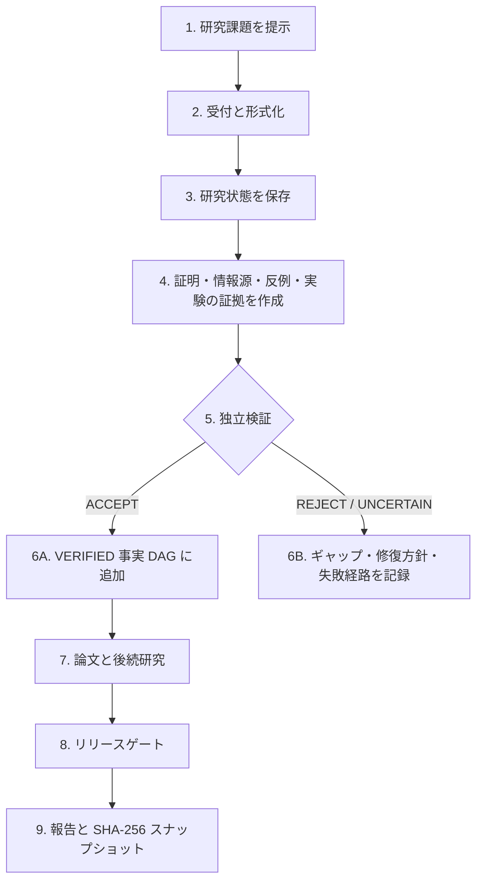

# ProofWeave（証明の織物）

[繁體中文](README.md) | [简体中文](README.zh-CN.md) | [English](README.en.md) | [日本語](README.ja.md)

**主張・証拠・独立検証を織り合わせた、監査可能な数学研究基盤。**

[GitHub リポジトリ](https://github.com/f0909172434/proofweave-math-lab)

ProofWeave は、数学研究・論文執筆・敵対的レビューのための、ローカルで動作するモデル非依存ワークスペースです。チャット履歴ではなく、永続ファイルと決定論的な検査を中核に据えています。証明、文献上の結果、数値的証拠、予想、未解決のギャップを明確に区別し、モデルの合意を真実とみなすことなく、すべてのモデルルーティング判断を記録します。

## ここから開始：プログラミング経験は不要です

Python、Git、JSON、LaTeX、コマンドラインを知っている必要はありません。ローカルファイルを扱える AI 研究エージェントでプロジェクトフォルダー全体を開き、普段の言葉で数学の課題を説明するのが最も簡単です。

### 10 分で始める方法（推奨）

1. [ProofWeave の GitHub ページ](https://github.com/f0909172434/proofweave-math-lab)を開き、**Code → Download ZIP** を選ぶか、[ZIP の直接ダウンロード](https://github.com/f0909172434/proofweave-math-lab/archive/refs/heads/main.zip)を使用します。
2. ZIP を展開します。圧縮ファイルの中で直接作業しないでください。
3. AI 研究エージェントで **Open folder** を選び、展開した `proofweave-math-lab` フォルダー全体を開きます。この README だけを開くのではありません。必要なら公式の [ChatGPT／Codex クイックスタート](https://learn.chatgpt.com/docs/quickstart)を参照してください。
4. 次のプロンプトを貼り付け、角括弧内をご自身の課題に置き換えます。

```text
ProofWeave を初めて使います。プログラミングの経験はありません。
ターミナル操作、コード作成、JSON の手作業による編集を要求しないでください。

AGENTS.md、workflows/00_project_intake.md、
workflows/01_problem_formalization.md をすべて読み、新しい数学研究
プロジェクトの開始を支援してください。

研究課題：
［ここに課題を書いてください。不完全でも構いません。］

一度に一つだけ短い質問をし、その情報が必要な理由を平易に説明して
ください。state/problem.md、state/assumptions.md、state/notation.md、
state/research_plan.md と必要な状態ファイルはあなたが更新してください。
まだ証明を試みず、予想、数値結果、複数 AI の合意を定理にしないでください。

受付完了後、正式な課題を平易に言い直し、仮定と記法を列挙し、すべての
不確実性を OPEN GAP として記録し、次の安全な一歩を提案して、利用可能な
プロジェクト検査を実行してください。有料 API、データのアップロード、
公開は、私の許可なしに行わないでください。
```

エージェントの質問に順番に答えてください。「分からない」も正しい回答です。推測せず、不確実性として記録されるべきです。最初のセッション後、`state/` には平易な課題説明、明確な定義域と仮定、完了条件、`OPEN GAP` 一覧、安全な次の行動が残ります。

## よく使う作業のプロンプト

| 目的 | そのまま使えるプロンプト |
| --- | --- |
| 進捗確認 | `state/STATUS.md、state/open_gaps.md、state/research_plan.md を読み、確認済み事項、未知の事項、次の手順を平易に説明してください。` |
| 文献整理 | `workflows/02_literature_review.md に従い、原典を確認して、開いて検証した証拠と検索上の手掛かりを区別してください。` |
| 方法の探索 | `workflows/03_idea_swarm.md に従い、本質的に異なる 3～5 個の方針を、主な障害、最小テスト、停止条件とともに提案してください。` |
| 証明の試行 | `workflows/04_proof_search.md に従い、最小の明確な主張を扱ってください。ギャップは UNCERTAIN のままにし、自分で VERIFIED と宣言しないでください。` |
| 反例探索 | `workflows/05_counterexample_search.md に従い、端点、退化ケース、最小次元を優先してください。有限計算は証拠としてのみ扱ってください。` |
| 数値実験 | `workflows/07_computational_experiment.md に従い、設定、コード、データ、図、限界を保存し、結果が証明ではないことを明記してください。` |
| 論文レビュー | `workflows/11_full_paper_review.md に従い、致命的、主要、軽微な問題と、人間の専門家による判断が必要な事項を分けてください。` |
| 引き継ぎ保存 | `workflows/14_session_handoff.md に従い、状態、判断、未解決ギャップ、失敗した方針を更新してください。` |

## 初心者が知っておくべき四つのこと

1. `VERIFIED` はプロジェクト内の状態であり、普遍的な数学的確実性や人間の査読を意味しません。
2. 大規模な計算でも、数値的一致は証拠であって証明ではありません。
3. 反例が見つからないことは証明ではありません。`PROPOSED`、`UNCERTAIN`、`OPEN GAP` を正直に使います。
4. 研究状態はプロジェクトファイルに保存されます。フォルダー全体をバックアップし、非公開研究を公開リポジトリへアップロードしないでください。

## 初心者向けファイル案内

| 場所 | 用途 |
| --- | --- |
| `state/problem.md` | 現在の研究課題と正確な目標 |
| `state/assumptions.md` | 仮定、制約、整合性上の懸念 |
| `state/notation.md` | 記号、定義域、記法の約束 |
| `state/research_plan.md` | 手順、リスク、停止条件、完了条件 |
| `state/STATUS.md` | 現在の進捗要約 |
| `state/open_gaps.md` | 未解決または未検証の課題 |
| `state/dead_ends.md` | 同じ作業の反復を防ぐための失敗経路 |
| `state/fact_graph.jsonl` | 形式的主張と依存関係 |
| `literature/`、`experiments/`、`paper/` | 文献、再現可能な実験、論文ファイル |

## よくある問題

- **プロジェクトが見つからない：** ZIP や単一ファイルではなく、`AGENTS.md`、`state/`、`workflows/` を直接含むフォルダーを開いてください。
- **API キーや支払いを求められる：** 「ローカルのネイティブモードを維持し、外部 API や有料呼び出しを有効にしないでください」と返答してください。
- **エラーが理解できない：** 完全なエラーをエージェントへ貼り、コマンドだけを提示するのではなく、直接診断・修正するよう依頼してください。
- **主張が証明済みとされる：** fact ID、完全な仮定、証明成果物、独立検証報告、依存関係を求めてください。欠けていれば `PROPOSED` または `UNCERTAIN` のままです。
- **作業がチャットにしかない：** セッション引き継ぎワークフローを依頼してください。チャットだけの内容は永続的な研究状態ではありません。

## ProofWeave でできること

ProofWeave は、課題を入力すれば正しい証明を保証するブラックボックスではありません。人間の研究者と AI エージェントが明示的な規則に従って協働するための、監査可能な研究基盤です。

| 研究タスク | 提供する支援 | 主な成果物 |
| --- | --- | --- |
| 問題の形式化 | 定義域、量化子、仮定、記法、境界条件、完了条件を明示 | `state/` の受付ファイル |
| 文献調査 | 検索候補、開いた原典、検証済みの主張単位の裏付けを分離 | 情報源レジストリと `literature/` |
| 戦略生成 | 証明、反例、玩具モデル、計算による異なる経路を構築 | 研究計画と作業成果物 |
| 証明探索 | 大きな問題を局所命題へ分解し、依存、試行、ギャップ、修復を記録 | `PROPOSED` 主張パケット |
| 反例探索 | 端点、退化ケース、最小次元、パラメータ極限を優先 | 反例、否定結果、有界探索報告 |
| 独立検証 | コールドスタート検証者とプログラムによる昇格ゲート | `ACCEPT`、`REJECT`、`UNCERTAIN` 報告 |
| 再現可能な実験 | 設定、環境、コード、生データ、出力、誤差、再現コマンドを保存 | `experiments/` の完全な実験パッケージ |
| 形式化探索 | Lean の実現可能性とビルドを記録し、早すぎる機械検証宣言を防止 | 形式化計画またはビルド成果物 |
| 論文作成とレビュー | 凍結した検証済みグラフから執筆し、LaTeX 主張と全体整合性を監査 | `paper/`、主張マップ、課題台帳 |
| モデル・予算ルーティング | ホスト能力、リスク、ツール、独立性、費用から監査可能な経路を推奨 | モデル一覧、ルーティングログ、予算状態 |
| リリース検証 | 構造、schema、事実、情報源、実験、論文、テスト、機密、ビルドを検査 | リリース報告とコンテンツハッシュ |

## 動作の流れ



読み方：研究課題をまず形式化して保存し、専門ロールが検査可能な証拠を作成します。独立検証者は `ACCEPT`、`REJECT`、`UNCERTAIN` のいずれかを返します。`ACCEPT` だけが検証済み事実グラフへ入り、それ以外はギャップまたは修復作業として残ります。

チャット出力は真理層ではありません。研究状態はファイルに保存し、形式的主張は独立検証と決定論的一貫性検査を通過して初めて、他の正式な主張の依存先になれます。

### 主張のライフサイクル

`DRAFT → PROPOSED → UNDER_REVIEW → VERIFIED / REJECTED / UNCERTAIN`

検証済み主張も、後に `REVOKED` または `SUPERSEDED` になる場合があります。

| 状態 | 意味 |
| --- | --- |
| `DRAFT` | まだレビュー可能な主張として整理されていない |
| `PROPOSED` | 作成者が完全な文、仮定、依存関係、証明パケットを提出した |
| `UNDER_REVIEW` | 独立検証者がコールドスタートで確認している |
| `VERIFIED` | 検証結果が `ACCEPT` で、決定論的一貫性ゲートも通過した |
| `REJECTED` | 決定的な欠陥があり、真理層へ入れない |
| `UNCERTAIN` | 証拠、ツール、情報が不足し、証明とは扱えない |
| `REVOKED` | 後の誤りまたは無効な依存関係により、検証済み事実が取り消された |
| `SUPERSEDED` | より新しい事実バージョンに置き換えられた |

主張の作成者は同じ主張を検証できません。独立した `theorem_verifier` だけが昇格できます。形式的依存は `VERIFIED` で循環がないことが必要です。取消し時にはすべての推移的子孫と影響を受ける論文・実験箇所を監査します。

## 中核技術設計

| コンポーネント | 実装と目的 |
| --- | --- |
| ランタイム | Python 3.11 以降。中核ランタイムは標準ライブラリのみを使用 |
| 永続データ | 人間が読める Markdown、JSON、JSONL、YAML、LaTeX ファイル |
| 構造検証 | 事実、情報源、実験、モデル、ルーティング、レビューを覆う 12 個の JSON Schema Draft 2020-12 schema |
| 真理層 | 循環防止、VERIFIED 限定依存、推移的取消しを備えた事実 DAG |
| 情報源層 | `FOUND → OPENED → VERIFIED` 状態と、裏付ける正確な主張・検証者の記録 |
| エージェント層 | 28 の標準ロール、18 のワークフロー、14 のプロンプト、Codex／Claude アダプター |
| ルーティング | MODE A–E 分類と、可用性、プライバシー、ツール、独立性、費用のフィルター |
| 実験ゲート | 設定、スクリプト、報告、成果物パス、実行可能な再現コマンドを検証 |
| 論文ゲート | 文ハッシュと独立検証記録により、LaTeX 主張を現在の検証済み事実へ結合 |
| リリースゲート | 72 の自動テストに加え、構造、schema、グラフ、情報源、実験、論文、機密、任意 PDF を検査 |
| 再現性 | 成功したリリースごとにファイル別ハッシュ一覧と SHA-256 スナップショット ID を生成 |
| 任意ツール | `pdflatex` と Lean に対応。未導入ツールを実行済みとは報告しない |

## 能力の境界

- ワークフローの強制はリスクを減らしますが、AI や人間の数学的誤りを完全には防げません。
- `VERIFIED` はプロジェクト状態であり、学術誌の査読、形式証明、絶対的真理ではありません。
- 文献検索にはブラウザーやデータベースツールが必要で、検索スニペットは検証済み情報源ではありません。
- Lean、LaTeX、外部モデル、有料 API は任意です。検出は利用許可を意味しません。
- ルーティングはポリシー適合経路を選ぶだけで、評判、多数決、信頼度が証明を代替することはありません。

## 実装済みの機能

- 循環を防止し、形式的依存を `VERIFIED` に限定する事実 DAG；
- コールドスタートと独立検証者だけによる昇格；
- 推移的な取消し連鎖と影響メタデータ；
- 検証済みの情報源レジストリと改訂課題台帳；
- 実験、参考文献、LaTeX 主張マップ、機密情報の検査；
- ホスト／プロバイダー／モデルの受動検出と MODE A–E 分類；
- タスク、推論、モデル、フォールバック、予算の決定論的ルーティング；
- ライブ／有料呼び出しと偽のランキングを既定で拒否するベンチマーク基盤；
- 28 の標準ロール、18 のワークフロー、14 のプロンプト、12 のスキーマ、および標準ファイルを参照する Codex／Claude ネイティブアダプター；
- 独立した奇数和の証明ワークフローと 6 件のドライルーティング実演；
- Python 標準ライブラリだけを使う CLI と自動テスト。

`VERIFIED` はプロジェクト内のワークフロー状態であり、人間による査読や形式的な絶対確実性を意味しません。Lean 対応は任意です。固定されたビルドで、禁止された `sorry`、`admit`、予期しない公理が存在しない場合にのみ機械検証済みと扱い、それでも形式化された文が意図した定理と一致するかを人間が確認します。

## 任意：コマンドラインでのクイックスタート

初心者はこの節を省略できます。決定論的ツールを自分で実行したい場合だけ、リポジトリのルートで Python 3.11 以降を使用します：

```powershell
python -m mathlab init
python -m mathlab status
python -m unittest discover -s tests -v
python -m mathlab release-check
```

現在の Codex Windows デスクトップ環境では、検証済み Python は Codex に同梱されており、Windows の裸の `python` エイリアスは信頼できない場合があります。同等の検証済みコマンドは次のとおりです：

```powershell
$py = 'C:\Users\user\.cache\codex-runtimes\codex-primary-runtime\dependencies\python\python.exe'
& $py -m mathlab status
& $py -m unittest discover -s tests -v
& $py -m mathlab release-check
```

実験ゲートは、記録された再現コマンドの先頭にある `python`、`python3`、`py` を、ProofWeave を実行中のインタープリターへ解決します。

最初の実研究プロジェクトを開始するには、`state/problem.md`、`state/assumptions.md`、`state/notation.md`、`state/research_plan.md` を編集し、次の指示をエージェントへ渡します：

> AGENTS.md と workflows/00_project_intake.md を読み、state/problem.md に記載された研究課題を形式化してください。まだ証明は試みないでください。定義域、量化子、仮定、記法、完了条件、初期リスク一覧を明示してください。定理目標、予想、数値的課題、文献上の課題を分離し、受付段階の状態ファイルだけを更新して、すべての曖昧さを OPEN GAP または人間による判断事項として報告してください。

## 研究フロー

1. 課題の受付と形式化。
2. 再現可能な情報源検索と、原文による厳密な裏付け確認。
3. 有界証明、障害分析、玩具モデルを含む 3～5 個の異なる戦略。
4. 局所的な `PROPOSED` 主張と反例探索。
5. CLI ゲートを通した独立定理検証。
6. 必要に応じた再現可能な実験（常に証拠として表示）。
7. 凍結した `VERIFIED` グラフと完全な主張マップに基づく論文設計・執筆。
8. 完全な数学的／査読者レビュー、改訂、リリース検査。
9. 状態、ギャップ、行き止まり、判断を保存するセッション引き継ぎ。

詳細は `docs/operator_guide.md`、`docs/workflow_guide.md`、`docs/design/architecture.md` を参照してください。

## CLI

研究状態：

```powershell
python -m mathlab add-source --file source.json
python -m mathlab add-claim --file claim.json
python -m mathlab verify FACT_ID --outcome ACCEPT --verifier NAME --report report.json
python -m mathlab revoke FACT_ID --reason "reason" --actor NAME
python -m mathlab graph-check
python -m mathlab experiment-check
python -m mathlab paper-check
python -m mathlab review --mode blind-referee
python -m mathlab release-check
```

機能とルーティング：

```powershell
python -m mathlab models detect
python -m mathlab models list
python -m mathlab models show MODEL_ID
python -m mathlab models doctor
python -m mathlab models refresh
python -m mathlab models benchmark
python -m mathlab route classify TASK_FILE
python -m mathlab route recommend TASK_FILE
python -m mathlab route explain ROUTING_ID
python -m mathlab route run TASK_FILE
python -m mathlab route history
python -m mathlab budget status
python -m mathlab budget estimate TASK_FILE
python -m mathlab providers status
```

ネイティブモードの `route run` は記録されたドライ引き継ぎであり、外部プロバイダーを密かに呼び出しません。運用者が `config/runtime_policy.json` を明示的に変更し、クォータ・プライバシー・費用への影響を受け入れるまで、CLI／API／ゲートウェイ実行は無効のままです。

## デモ

```powershell
python -m scripts.run_toy_workflow
python -m scripts.run_routing_demo
python -m scripts.compile_paper
```

玩具ワークフローは、正しい帰納法の証明を受理し、近似によるギャップを拒否し、受理済みの事実を LaTeX に対応付け、`pdflatex` があればコンパイルします。リリース成功時には `state/release_report.json` とコンテンツアドレス方式の `state/release_manifest.json` を書き出し、正確なファイルハッシュのスナップショットを生成します。

## ネイティブエージェントとスキル

- `agents/` は標準ポリシーの情報源です。
- `.codex/agents/` と `.claude/agents/` は自動生成される薄いアダプターです。
- `.agents/skills/` と `.claude/skills/` はワークフローの入口を提供します。
- ロールまたはワークフローを変更した後は、`python -m scripts.generate_native_adapters` で再生成します。
- `.claude/settings.example.json` は任意のフック例です。有効化前に最新の Claude Code 文書を確認してください。

## 安全性と費用の既定値

実際の `.env` は作成しません。状態とログに秘密鍵、Cookie、トークンを含めることは禁止されています。明示的な許可がない限り、有料プローブ、プロバイダー API、CLI サブプロセスエージェント、公開、push、アップロード、メッセージ送信は無効です。並列エージェントとエスカレーションループには上限があります。予算不足時は `BLOCKED_BY_BUDGET` または `NEEDS_HUMAN_DECISION` を返し、検証基準を弱めることはありません。

情報源とライセンスの判断は `docs/design/source_basis.md` と `state/source_registry.jsonl` に記録されています。Danus は調査しましたが、コピーもインストールもしていません。
