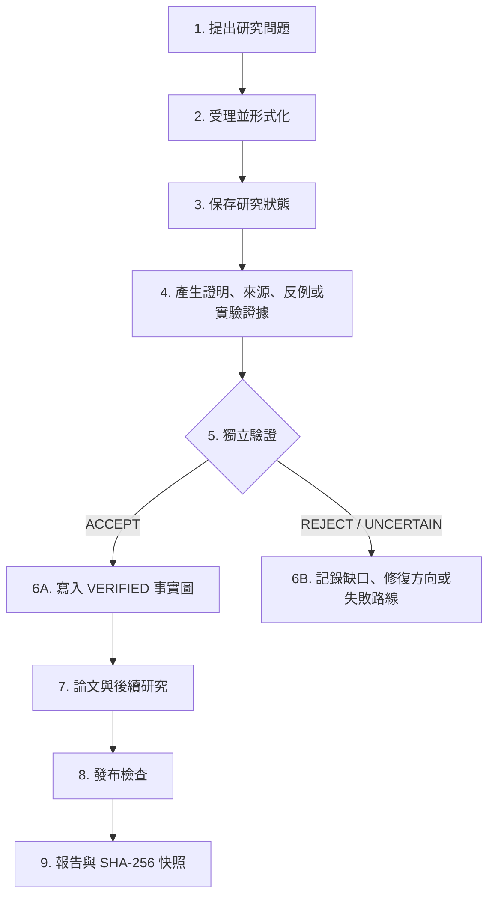

# ProofWeave（證明織網）

[繁體中文](README.md) | [简体中文](README.zh-CN.md) | [English](README.en.md) | [日本語](README.ja.md)

**把命題、證據與獨立驗證織成一套可稽核的數學研究流程。**

[GitHub 儲存庫](https://github.com/f0909172434/proofweave-math-lab)

ProofWeave 是一個在本機執行、與模型供應商無關的數學研究工作區，適用於研究、論文寫作與對抗式審查。它以持久化檔案與確定性檢查為核心，而不是依賴聊天紀錄。系統明確區分證明、文獻結果、數值證據、猜想與尚未解決的缺口，並記錄每一次模型路由決策，但不把多個模型意見一致當成真理。

## 先看這裡：不會寫程式也能使用

你不需要會 Python、Git、JSON、LaTeX 或命令列，便能開始使用 ProofWeave。最簡單的方式，是把整個資料夾交給能讀寫本機檔案的 AI 研究代理，然後用日常語言描述研究問題。

開始前只需要：

1. 一台 Windows、macOS 或 Linux 電腦；
2. 一個可以開啟本機資料夾的 AI 研究／程式代理，例如 Codex 的桌面工作區；
3. 一個你想研究的數學問題，即使目前描述得不精確也可以。

第一次使用時，不需要 GitHub 帳號，也不需要 API 金鑰。ProofWeave 預設不會呼叫付費模型服務，也不會自動上傳、發布或傳送你的研究內容。

## 10 分鐘快速開始（推薦，不用終端機）

### 第 1 步：下載並解壓縮

如果你現在不在這個專案資料夾裡，請開啟 [ProofWeave GitHub 頁面](https://github.com/f0909172434/proofweave-math-lab)，按綠色 **Code** 按鈕，再選擇 **Download ZIP**。也可以使用[直接下載連結](https://github.com/f0909172434/proofweave-math-lab/archive/refs/heads/main.zip)。

下載完成後，在 ZIP 檔上按右鍵，選擇「全部解壓縮」。請不要直接在壓縮檔裡操作。

### 第 2 步：用 AI 代理開啟整個資料夾

在你的 AI 研究代理中選擇「開啟資料夾／Open folder」，選取剛剛解壓縮的 `proofweave-math-lab` 資料夾。務必開啟整個資料夾，而不是只打開 `README.md`。

如果尚未安裝可用的代理，可先參考 OpenAI 官方的 [ChatGPT 與 Codex 快速入門](https://learn.chatgpt.com/docs/quickstart)。不同版本的按鈕名稱可能略有差異，但重點都是讓代理取得這個資料夾的工作區權限。

### 第 3 步：複製並貼上這段話

把下面整段提示貼給代理；只要把「我的研究問題是」後面的文字換成你的問題即可：

```text
我是第一次使用 ProofWeave，也不會寫程式。請全程使用繁體中文，
不要要求我操作終端機、編寫程式或手動修改 JSON。

請先完整閱讀 AGENTS.md、workflows/00_project_intake.md 與
workflows/01_problem_formalization.md，再協助我建立一個新的數學研究專案。

我的研究問題是：
【在這裡寫下你的問題；不完整也沒關係】

請一次只問我一個簡短問題，用一般語言說明為什麼需要這項資訊。
你負責更新 state/problem.md、state/assumptions.md、state/notation.md、
state/research_plan.md 與必要的狀態檔案。先不要嘗試證明，也不要把猜想、
數值結果或多個 AI 的共同意見寫成定理。

在我回答完必要問題後，請：
1. 用白話重述正式研究問題；
2. 列出已知假設、符號、目標與仍待確認之處；
3. 把不確定事項標成 OPEN GAP；
4. 提出下一個最安全的小步驟；
5. 執行專案可用的檢查並告訴我結果。

不要使用付費 API、不要上傳資料、不要發布內容；若確實需要，必須先問我。
```

### 第 4 步：回答代理的問題

代理通常會詢問以下內容。你不知道時直接回答「不知道」即可，系統應把它記為待解問題，而不是替你猜測。

- 變數在哪個範圍內，例如實數、正數、整數或某個函數空間？
- 哪些條件已知，哪些只是希望成立？
- 你想得到證明、反例、數值圖、文獻整理，還是論文草稿？
- 是否允許數值實驗或形式化證明？
- 有沒有期限、隱私或費用限制？

### 第 5 步：確認第一階段成果

第一次對話結束前，應該得到：

- 一段你看得懂的研究問題重述；
- 清楚的變數範圍、假設與符號；
- 「要做到什麼才算完成」的明確說明；
- 已知風險與 `OPEN GAP` 清單；
- 下一步建議，但還不會把未完成的推導宣稱成證明。

這些內容會寫入 `state/` 資料夾。下次開啟專案時，代理可以從檔案繼續，不需要只依賴先前的聊天紀錄。

## 接下來要做什麼：直接複製這些提示

完成第一次受理後，可以依需要把下列任一句貼給代理。代理應先讀取專案目前狀態，再決定正確工作流程。

| 你的目的 | 可以直接貼上的提示 |
| --- | --- |
| 查看進度 | `請閱讀 state/STATUS.md、state/open_gaps.md 與 state/research_plan.md，用白話告訴我目前做到哪裡、什麼已證實、什麼還不知道，以及下一步。` |
| 查找文獻 | `請依 workflows/02_literature_review.md 整理這個問題的文獻地圖。請核對原始來源，分開標示已開啟確認的資料與僅供追查的線索。` |
| 尋找不同方法 | `請依 workflows/03_idea_swarm.md 提出 3 到 5 條本質不同的研究路線，說明每條路線的關鍵障礙、最小測試與停止條件。` |
| 嘗試證明 | `請依 workflows/04_proof_search.md 處理目前最小且明確的命題。完整寫出假設與依賴；有缺口就標示 UNCERTAIN，不要自行宣布 VERIFIED。` |
| 尋找反例 | `請依 workflows/05_counterexample_search.md 優先測試端點、退化情形與最小維度，並保存失敗嘗試。有限數值搜尋只能算證據。` |
| 做數值實驗 | `請依 workflows/07_computational_experiment.md 設計可重現實驗，保存設定、程式、資料、圖與限制，並明確標示結果不是證明。` |
| 撰寫論文 | `請先確認可使用的 VERIFIED 事實與 paper/claim_map.yml，再依 workflows/09_paper_planning.md 規劃論文。不要把研究筆記中的猜想寫成定理。` |
| 審查論文 | `請依 workflows/11_full_paper_review.md 進行嚴格審查，分開列出致命問題、主要修訂、次要修訂與仍需人類判斷的部分。` |
| 保存並交接 | `請依 workflows/14_session_handoff.md 更新狀態、決策、未解缺口與失敗路線，讓下一次工作可以直接繼續。` |

## 初學者一定要知道的四件事

1. **`VERIFIED` 不等於世界公認的定理。** 它只表示一位獨立驗證角色接受了專案內記錄的證明包；人類專家仍應檢查核心結論。
2. **數值計算不是證明。** 即使測試一百萬個例子都成立，也只能記為數值證據，不能直接推出對所有情況成立。
3. **找不到反例不代表已證明。** ProofWeave 會保留 `PROPOSED`、`UNCERTAIN` 與 `OPEN GAP` 等狀態，避免過度宣稱。
4. **重要檔案都在專案資料夾內。** 請定期備份整個資料夾；若內容尚未公開，不要把它上傳到公開 GitHub 儲存庫。

## 你會看到哪些檔案

初學者不需要手動編輯大部分檔案，但知道它們的用途有助於判斷代理是否走在正確方向。

| 位置 | 用途 |
| --- | --- |
| `state/problem.md` | 目前研究問題與精確目標 |
| `state/assumptions.md` | 已知假設、限制與相容性問題 |
| `state/notation.md` | 符號、定義域與記號約定 |
| `state/research_plan.md` | 研究步驟、風險、停止條件與完成標準 |
| `state/STATUS.md` | 最新進度摘要 |
| `state/open_gaps.md` | 尚未解決或無法確認的問題 |
| `state/dead_ends.md` | 已嘗試但失敗的路線，避免重複浪費時間 |
| `state/fact_graph.jsonl` | 形式命題與依賴關係；只有經過流程驗證的事實才能成為正式依賴 |
| `literature/` | 文獻資料與參考書目 |
| `experiments/` | 可重現的數值或符號實驗 |
| `paper/` | 論文 LaTeX 來源、命題對照與輸出 |
| `workflows/` | 各種研究任務的標準步驟 |

## 常見問題

### 代理說找不到專案

確認開啟的是包含 `AGENTS.md`、`README.md`、`state/` 與 `workflows/` 的最外層資料夾，而不是 ZIP 檔、單一檔案或上一層桌面。

### 代理要求我輸入 API 金鑰或付費

第一次使用不需要。請回覆：「維持本機原生模式，不要啟用外部 API 或付費呼叫。」若某項任務確實只能靠外部服務完成，代理應先說明原因、資料風險與可能費用，再等待你的明確同意。

### 我不懂錯誤訊息或 PowerShell

把完整錯誤訊息貼給代理，並說：「請你直接診斷與修復；除非一定需要我操作，否則不要只給我指令。」不要只截取最後一行，完整訊息通常比較容易判斷。

### 代理說某個命題已經證明

要求它指出對應的 fact ID、完整假設、證明檔案、獨立驗證報告與依賴。若缺少任何一項，就應保持 `PROPOSED` 或 `UNCERTAIN`，而不是 `VERIFIED`。

### 我可以只用聊天、不保存檔案嗎？

不建議。ProofWeave 的核心價值就是讓研究狀態、證據與失敗路線保存在檔案中。只留在聊天裡的內容，下一次可能遺失，也無法通過發布檢查。

## ProofWeave 能做什麼

ProofWeave 不是一個「輸入題目就保證產生正確證明」的黑盒子。它提供的是一套可追蹤的研究基礎設施，讓人類研究者與 AI 代理按照明確規則合作。

| 研究任務 | ProofWeave 提供的支援 | 主要產物 |
| --- | --- | --- |
| 問題形式化 | 補齊定義域、量詞、假設、符號、邊界條件與完成標準 | `state/problem.md`、`assumptions.md`、`notation.md` |
| 文獻調查 | 分開記錄搜尋線索、已開啟原文與已核對的精確支持範圍 | `state/source_registry.jsonl`、`literature/` |
| 研究策略生成 | 建立多條本質不同的證明、反例、玩具模型或計算路線 | `state/research_plan.md`、研究工作產物 |
| 證明搜尋 | 把大問題拆成局部命題，記錄依賴、嘗試、缺口與修復方向 | `PROPOSED` 命題與證明包 |
| 反例搜尋 | 優先檢查端點、退化情形、最小維度及參數極限 | 反例、被否證命題或有界搜尋報告 |
| 獨立驗證 | 由未參與原證明的驗證角色冷啟動檢查，程式閘門控制狀態晉升 | `ACCEPT`、`REJECT` 或 `UNCERTAIN` 報告 |
| 數值與符號實驗 | 保存設定、環境、程式、原始資料、輸出、誤差與重現指令 | `experiments/` 下的完整實驗包 |
| 形式化探索 | 規劃 Lean 形式化；只有固定版本成功建置且通過限制檢查才算機器檢查 | 形式化計畫或建置產物 |
| 論文寫作 | 只從凍結的已驗證事實與已核對來源規劃 LaTeX 論文 | `paper/` 與 `paper/claim_map.yml` |
| 論文審查 | 檢查論述強度、依賴、引用、記號、跨章一致性與數學缺口 | 分級問題帳冊與修訂計畫 |
| 模型與預算路由 | 偵測當前主機能力，依任務風險、工具、成本與獨立性提出可稽核建議 | 模型清冊、路由紀錄與預算狀態 |
| 發布前檢查 | 執行結構、schema、事實圖、來源、實驗、論文、測試、機密與建置檢查 | 發布報告與內容雜湊快照 |

## 它怎麼運作



閱讀方式：研究問題先被形式化並保存；不同角色產生可檢查的證據；獨立驗證者作出 `ACCEPT`、`REJECT` 或 `UNCERTAIN` 判定。只有 `ACCEPT` 能進入已驗證事實圖，其他結果則保留為缺口或修復工作。

聊天內容本身不是真理層。研究狀態必須寫入檔案；形式命題只有通過獨立驗證與程式一致性檢查後，才能成為其他正式命題的依賴。

### 命題生命週期

`DRAFT → PROPOSED → UNDER_REVIEW → VERIFIED / REJECTED / UNCERTAIN`

已驗證命題日後也可能變成 `REVOKED` 或 `SUPERSEDED`。

| 狀態 | 意義 |
| --- | --- |
| `DRAFT` | 尚未整理成可送審的命題 |
| `PROPOSED` | 作者已提交完整陳述、假設、依賴與證明包 |
| `UNDER_REVIEW` | 正由獨立驗證者冷啟動檢查 |
| `VERIFIED` | 獨立驗證結果為 `ACCEPT`，且通過程式一致性閘門 |
| `REJECTED` | 發現決定性錯誤，不能進入真理層 |
| `UNCERTAIN` | 證據、工具或資訊不足，不能視為證明 |
| `REVOKED` | 先前驗證的事實因新錯誤或無效依賴被撤銷 |
| `SUPERSEDED` | 已由較新的事實版本取代 |

- 命題作者可以提交 `PROPOSED`，但不能驗證自己的命題。
- 只有冷啟動的獨立 `theorem_verifier` 可以透過 `ACCEPT` 將命題晉升為 `VERIFIED`。
- 正式依賴只能指向 `VERIFIED` 事實，且依賴圖禁止循環。
- 若已驗證事實被撤銷，其所有傳遞後代以及受影響的論文、實驗位置都會列入撤銷稽核。

## 核心技術設計

| 元件 | 技術與作用 |
| --- | --- |
| 執行環境 | Python 3.11 以上；核心執行期只使用標準函式庫，降低安裝門檻 |
| 持久狀態 | Markdown、JSON、JSONL、YAML 與 LaTeX 檔案；可由人類閱讀、版本控制與稽核 |
| 結構驗證 | 12 個 JSON Schema Draft 2020-12 schema，驗證事實、來源、實驗、模型、路由與審查紀錄 |
| 事實圖 | 具循環防護的有向無環圖，只允許已驗證的形式依賴，並支援傳遞式撤銷 |
| 來源系統 | `FOUND → OPENED → VERIFIED` 分級；驗證時必須記錄精確支持的主張與核對者 |
| 代理架構 | 28 個標準角色、18 套工作流程與 14 份提示詞；Codex／Claude 轉接器只引用標準來源 |
| 模型路由 | MODE A–E 能力分類；先做可用性、隱私、工具與成本硬篩選，再記錄路由決策 |
| 實驗閘門 | 檢查設定、程式、報告、資料路徑與實際重現指令；數值結果永遠維持證據身分 |
| 論文閘門 | LaTeX 命題必須映射至當前 `VERIFIED` 事實，並以陳述雜湊與獨立核對紀錄偵測替換 |
| 發布閘門 | 執行 72 項自動測試及結構、來源、圖、實驗、論文、機密掃描與可選 PDF 建置 |
| 可重現快照 | 發布成功後產生逐檔雜湊清單與 SHA-256 snapshot ID，固定當次研究內容基線 |
| 選用工具 | 可搭配 `pdflatex` 編譯論文，也可規劃 Lean 建置；未安裝時不會冒充已執行 |

## 能力邊界

- ProofWeave 可以強制記錄與檢查流程，但不能保證 AI 或人類沒有犯數學錯誤。
- `VERIFIED` 是本專案的獨立驗證狀態，不等於期刊同儕審查、正式證明或絕對真理。
- 文獻搜尋需要可用的瀏覽或資料庫工具；搜尋摘要不能直接成為已驗證來源。
- Lean、LaTeX、外部模型與付費 API 都是選用功能；偵測到安裝或金鑰不等於自動獲准使用。
- 模型路由只選擇符合政策的執行方式，不以模型聲望、多數決或信心分數取代證明。

## 已實作功能

- 具備循環防護與「僅允許 VERIFIED 形式依賴」的事實有向無環圖；
- 冷啟動、獨立驗證者限定的狀態晉升；
- 傳遞式撤銷連鎖與影響範圍中繼資料；
- 經驗證的來源登錄表與修訂問題帳冊；
- 實驗、參考文獻、LaTeX 命題對照與機密資訊檢查；
- 被動偵測主機、供應商與模型，並分類為 MODE A–E；
- 確定性的任務、推理、模型、備援與預算路由；
- 預設拒絕即時／付費呼叫與虛假排名的基準測試框架；
- 28 個標準角色、18 套工作流程、14 份提示詞、12 個結構綱要，以及指向標準檔案的 Codex／Claude 原生轉接器；
- 隔離的奇數和證明流程與六個乾式路由示範；
- 僅依賴 Python 標準函式庫的命令列工具與自動測試。

`VERIFIED` 只是專案內的工作流程狀態，不代表人類同儕審查或形式上的絕對確定。Lean 支援是選用功能；只有在固定版本的建置中不存在被禁止的 `sorry`、`admit` 或非預期公理時，才能標記為機器檢查，且仍須由人類確認形式陳述與原始定理一致。

## 進階：使用命令列（選用）

這一節提供給熟悉命令列，或需要自行執行自動檢查的人。完全沒有程式經驗的使用者可以先略過；上面的「10 分鐘快速開始」已足以啟動研究流程。

在儲存庫根目錄使用 Python 3.11 或更新版本：

```powershell
python -m mathlab init
python -m mathlab status
python -m unittest discover -s tests -v
python -m mathlab release-check
```

在目前的 Codex Windows 桌面環境中，已驗證的 Python 隨 Codex 提供，而 Windows 的裸 `python` 別名未必可靠。等效指令如下：

```powershell
$py = 'C:\Users\user\.cache\codex-runtimes\codex-primary-runtime\dependencies\python\python.exe'
& $py -m mathlab status
& $py -m unittest discover -s tests -v
& $py -m mathlab release-check
```

實驗檢查會把重現指令開頭的 `python`、`python3` 或 `py` 解析為正在執行 ProofWeave 的直譯器。

若採用命令列方式開始第一個真實研究專案，可編輯 `state/problem.md`、`state/assumptions.md`、`state/notation.md` 與 `state/research_plan.md`，然後把以下提示交給代理：

> 閱讀 AGENTS.md 與 workflows/00_project_intake.md。將 state/problem.md 中的研究問題形式化，但先不要嘗試證明。明確寫出定義域、量詞、假設、記號、完成定義與初始風險清單。分開標示定理目標、猜想、數值問題與文獻問題；只更新研究受理階段的狀態檔案，並把所有歧義記為 OPEN GAP 或待人類決策事項。

## 研究流程

1. 問題受理與形式化。
2. 可重現的來源搜尋，並開啟原文核對精確支持範圍。
3. 提出三至五條不同策略，涵蓋有界證明、障礙分析與玩具模型路線。
4. 建立局部 `PROPOSED` 命題並嘗試尋找反例。
5. 透過命令列閘門進行獨立定理驗證。
6. 視需要進行可重現實驗，且永遠標示為證據而非證明。
7. 依凍結的 `VERIFIED` 圖與完整命題對照表規劃及撰寫論文。
8. 完整數學／審稿人審查、修訂與發布檢查。
9. 交接工作階段，保存狀態、缺口、失敗路線與決策。

詳見 `docs/operator_guide.md`、`docs/workflow_guide.md` 與 `docs/design/architecture.md`。

## 命令列工具

研究狀態：

```powershell
python -m mathlab add-source --file source.json
python -m mathlab add-claim --file claim.json
python -m mathlab verify FACT_ID --outcome ACCEPT --verifier NAME --report report.json
python -m mathlab revoke FACT_ID --reason "reason" --actor NAME
python -m mathlab graph-check
python -m mathlab experiment-check
python -m mathlab paper-check
python -m mathlab review --mode blind-referee
python -m mathlab release-check
```

能力與路由：

```powershell
python -m mathlab models detect
python -m mathlab models list
python -m mathlab models show MODEL_ID
python -m mathlab models doctor
python -m mathlab models refresh
python -m mathlab models benchmark
python -m mathlab route classify TASK_FILE
python -m mathlab route recommend TASK_FILE
python -m mathlab route explain ROUTING_ID
python -m mathlab route run TASK_FILE
python -m mathlab route history
python -m mathlab budget status
python -m mathlab budget estimate TASK_FILE
python -m mathlab providers status
```

最小且可稽核的 context packet：

```powershell
python -m mathlab context build FACT_ID --role theorem_verifier --profile max
python -m mathlab context check PACKET.json
python -m mathlab context explain PACKET.json
```

Context compiler 只包含任務、精確命題、假設與 VERIFIED 依賴閉包；遇到
超額證明或依賴鏈會回傳 context review，而不會靜默截斷。

在原生模式中，`route run` 只會記錄乾式交接，不會暗中呼叫外部供應商。除非操作者明確修改 `config/runtime_policy.json`，並接受額度、隱私與費用後果，否則 CLI、API 與閘道執行都保持停用。

## 示範

```powershell
python -m scripts.run_toy_workflow
python -m scripts.run_routing_demo
python -m scripts.compile_paper
```

玩具流程會接受正確的歸納證明、拒絕近似造成的缺口、把已接受事實對應至 LaTeX，並在系統具備 `pdflatex` 時編譯。每次成功發布都會寫入 `state/release_report.json` 與內容定址的 `state/release_manifest.json`，產生精確的檔案雜湊快照。

## 原生代理與技能

- `agents/` 是標準政策來源。
- `.codex/agents/` 與 `.claude/agents/` 是自動產生的輕量轉接器。
- `.agents/skills/` 與 `.claude/skills/` 提供工作流程入口。
- 角色或工作流程變更後，執行 `python -m scripts.generate_native_adapters` 重新產生轉接器。
- `.claude/settings.example.json` 是選用掛鉤範例；啟用前請先查閱最新 Claude Code 文件。

## 安全與費用預設值

專案不會建立真正的 `.env`。狀態與日誌禁止包含密鑰、Cookie 或權杖。除非得到明確授權，付費探測、供應商 API、CLI 子行程代理、發布、推送、上傳與傳訊都保持停用。平行代理與升級循環均有界限。預算失敗會回傳 `BLOCKED_BY_BUDGET` 或 `NEEDS_HUMAN_DECISION`，絕不降低驗證標準。

來源與授權決策記錄於 `docs/design/source_basis.md` 與 `state/source_registry.jsonl`。專案曾研究 Danus，但沒有複製或安裝其內容。
