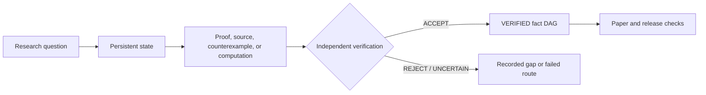

# ProofWeave

[English](README.md) | [繁體中文](README.zh-TW.md) | [简体中文](README.zh-CN.md) | [日本語](README.ja.md)

[](https://github.com/f0909172434/proofweave-math-lab/actions/workflows/ci.yml)
[](https://github.com/f0909172434/proofweave-math-lab/actions/workflows/codeql.yml)
[](LICENSE)
[](docs/user_guide.md)

**A local-first workspace for auditable, AI-assisted mathematics research.**

> **Project status: experimental 0.1.** Interfaces and research workflows are
> still being tested. ProofWeave helps preserve evidence and enforce review
> gates; it does not guarantee a correct theorem, replace expert review, or
> turn model agreement or computation into proof.

ProofWeave keeps the durable research record in ordinary files rather than in
chat history. It separates proof proposals, sources, computations, failed
routes, and open gaps, then applies deterministic checks around an independent
verification workflow. The core runtime is Python 3.11+ and uses only the
standard library.

## Three-minute reproducible demonstration

Clone or download the repository, open a terminal in its root, and run:

```console
python -m scripts.run_toy_workflow
```

The isolated `examples/toy_odd_sum/` fixture should finish with:

```text
status: PASS
toy-odd-sum: VERIFIED
toy-odd-sum-flawed: REJECTED
```

The accepted fixture contains a complete induction packet; the rejected
fixture contains an intentional gap. The verifier decisions are reviewed test
fixtures, not evidence that an AI proved or reviewed a theorem during the run.
The demonstration writes only inside its isolated example and does not promote
anything in the real project fact graph. If `pdflatex` is unavailable, the
optional PDF step is reported as unsupported without changing the truth-status
result.

For a no-terminal introduction, copy-ready prompts, troubleshooting, the full
CLI reference, and the research flow, read the [user guide](docs/user_guide.md).

## Truth boundary

`state/fact_graph.jsonl` is the formal project truth layer. Chat messages,
model outputs, search snippets, numerical scans, formalization attempts, and
consensus remain evidence until the recorded gates say otherwise.

| Status | What it means |
| --- | --- |
| `DRAFT` | Work is not yet a reviewable claim. |
| `PROPOSED` | A statement, assumptions, dependencies, and proof packet await independent review. |
| `UNDER_REVIEW` | A cold-start verifier is checking the submitted packet. |
| `VERIFIED` | An independent verifier returned `ACCEPT` and deterministic consistency gates passed. |
| `REJECTED` / `UNCERTAIN` | A flaw was found, or the available evidence is insufficient. |
| `REVOKED` / `SUPERSEDED` | A later audit withdrew or replaced an earlier fact. |

Only an independent `theorem_verifier` may promote a `PROPOSED` claim, and it
may not verify its own work. Dependencies must already be `VERIFIED` and
acyclic. `VERIFIED` is a ProofWeave workflow status—not formal proof, journal
peer review, infallibility, or universal mathematical certainty.

## How the workspace fits together



ProofWeave is useful when you want a reviewable local record, explicit
assumptions and dependencies, reproducible experiments, and conservative
claim status. It is not a hosted collaboration service, a proof assistant, an
autonomous theorem prover, or a substitute for a domain expert. Lean, LaTeX,
web access, and external model providers are optional; detecting a tool never
authorizes its use.

## Deterministic checks

From the repository root:

```console
python -m unittest discover -s tests -v
python -m mathlab graph-check
python -m scripts.validate_project --quick
python -m mathlab release-check
```

Passing these checks validates repository contracts and recorded consistency.
It does not independently establish the mathematical truth of a claim.

## Documentation

| Read this | For |
| --- | --- |
| [User guide](docs/user_guide.md) | No-code onboarding, FAQ, full CLI reference, demonstrations, and handoff flow |
| [Operator guide](docs/operator_guide.md) | Safely operating the fact, source, experiment, and release gates |
| [Workflow guide](docs/workflow_guide.md) | End-to-end research stages and handoffs |
| [Architecture](docs/design/architecture.md) | Components and evidence flow |
| [Threat model and boundaries](docs/design/threat_model.md) | Trust, data, credential, and residual-risk boundaries |
| [Mathematical quality standard](docs/mathematical_quality_standard.md) | Required statement, proof, source, numerical, and manuscript checks |
| [Agent contracts](docs/agent_contracts.md) | Role authority and independent-verification rules |

## Security, privacy, and contributing

The core workflow requires no API key. Treat everything committed to a public
repository as public, keep credentials and private research out of logs and
tracked files, and review the [security policy](SECURITY.md) before reporting a
vulnerability. External providers remain disabled until an operator explicitly
accepts their privacy, cost, and authorization consequences.

Contributions are welcome; read [CONTRIBUTING.md](CONTRIBUTING.md) before
changing code, workflows, or research-governance contracts. Public author and
maintainer metadata uses **Wang Chih Kai**.

Released under the [MIT License](LICENSE).
