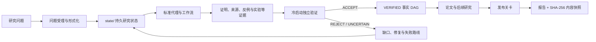
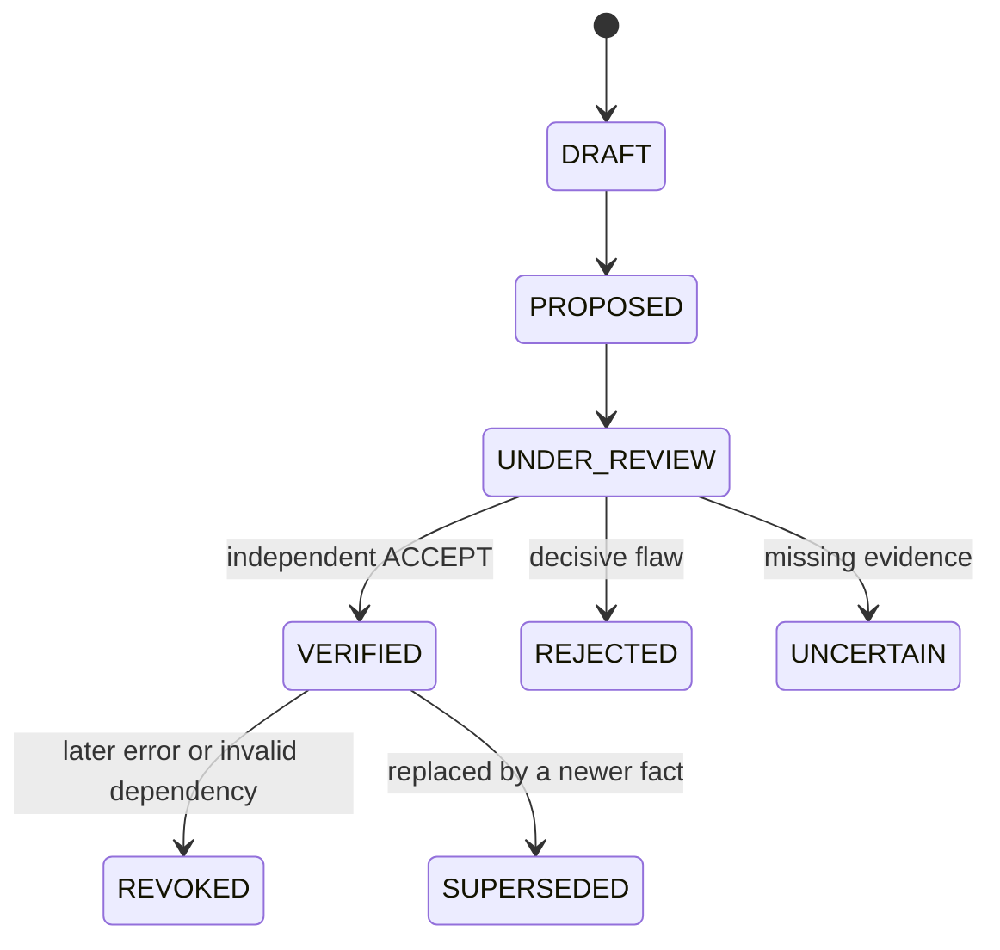

# ProofWeave（证明织网）

[繁體中文](README.md) | [简体中文](README.zh-CN.md) | [English](README.en.md) | [日本語](README.ja.md)

**把命题、证据与独立验证织成一套可审计的数学研究流程。**

[GitHub 仓库](https://github.com/f0909172434/proofweave-math-lab)

ProofWeave 是一个在本地运行、与模型供应商无关的数学研究工作区，适用于研究、论文写作与对抗式审查。它以持久化文件和确定性检查为核心，而不是依赖聊天记录。系统明确区分证明、文献结果、数值证据、猜想与尚未解决的缺口，并记录每一次模型路由决策，但不把多个模型意见一致当作真理。

## ProofWeave 能做什么

ProofWeave 不是一个“输入问题就保证生成正确证明”的黑盒。它是一套可审计的研究基础设施，让人工研究者与 AI 代理按明确规则协作。

| 研究任务 | 提供的支持 | 主要产物 |
| --- | --- | --- |
| 问题形式化 | 补全定义域、量词、假设、符号、边界条件与完成标准 | `state/` 下的受理文件 |
| 文献调查 | 区分搜索线索、已打开原文与已验证的精确支持范围 | 来源登记表与 `literature/` |
| 研究策略 | 建立不同的证明、反例、玩具模型与计算路线 | 研究计划与工作产物 |
| 证明搜索 | 把大问题拆成局部命题，记录依赖、尝试、缺口与修复方向 | `PROPOSED` 命题包 |
| 反例搜索 | 优先测试端点、退化情况、最小维度与参数极限 | 反例、否证或有界搜索报告 |
| 独立验证 | 使用冷启动验证者与程序化晋升关卡 | `ACCEPT`、`REJECT` 或 `UNCERTAIN` 报告 |
| 可复现实验 | 保存设置、环境、程序、原始数据、输出、误差与复现命令 | `experiments/` 下的完整实验包 |
| 形式化探索 | 支持 Lean 可行性与构建记录，不提前宣称机器验证 | 形式化计划或构建产物 |
| 论文写作与审查 | 从冻结的已验证事实图写作，映射 LaTeX 命题并检查全局一致性 | `paper/`、命题映射与问题台账 |
| 模型与预算路由 | 根据主机能力、风险、工具、独立性和费用给出可审计建议 | 模型清单、路由记录与预算状态 |
| 发布验证 | 检查结构、schema、事实、来源、实验、论文、测试、机密与构建 | 发布报告与内容哈希快照 |

## 运作方式



聊天输出不是真理层。研究状态必须写入文件；形式命题只有通过独立验证与确定性一致性检查后，才能成为其他正式命题的依赖。

### 命题生命周期



命题作者不能验证自己的命题。只有独立的 `theorem_verifier` 可以执行晋升。形式依赖必须处于 `VERIFIED` 状态且不能形成循环。撤销时会审计所有传递后代以及受影响的论文与实验位置。

## 核心技术设计

| 组件 | 实现与作用 |
| --- | --- |
| 运行环境 | Python 3.11 以上；核心运行时仅使用标准库 |
| 持久数据 | 人工可读的 Markdown、JSON、JSONL、YAML 与 LaTeX 文件 |
| 结构验证 | 12 个 JSON Schema Draft 2020-12 schema，覆盖事实、来源、实验、模型、路由与审查 |
| 真理层 | 具备循环防护、仅允许 VERIFIED 依赖并支持传递撤销的事实 DAG |
| 来源层 | `FOUND → OPENED → VERIFIED` 分级，并记录精确支持的主张和验证者 |
| 代理层 | 28 个标准角色、18 套工作流、14 份提示词及 Codex／Claude 适配器 |
| 模型路由 | MODE A–E 能力分类，以及可用性、隐私、工具、独立性和费用筛选 |
| 实验关卡 | 验证设置、程序、报告、产物路径与可执行复现命令 |
| 论文关卡 | 使用陈述哈希与独立核对记录，把 LaTeX 命题绑定到当前已验证事实 |
| 发布关卡 | 执行 72 项自动测试，以及结构、schema、图、来源、实验、论文、机密和可选 PDF 检查 |
| 可复现性 | 每次成功发布生成逐文件哈希清单与 SHA-256 快照 ID |
| 可选工具 | 可使用 `pdflatex` 与 Lean；未安装的工具绝不会被报告为已执行 |

## 能力边界

- 流程约束可以降低风险，但不能保证 AI 或人工完全没有数学错误。
- `VERIFIED` 是项目状态，不等于期刊同行评审、形式证明或绝对真理。
- 文献搜索依赖可用的浏览或数据库工具；搜索摘要不能成为已验证来源。
- Lean、LaTeX、外部模型与付费 API 均为可选；检测到并不代表已经授权。
- 路由只选择符合政策的执行方式；声誉、多数表决和信心分数不能取代证明。

## 从这里开始：不会编程也能使用

你不需要掌握 Python、Git、JSON、LaTeX 或命令行。最简单的方式，是让能够读写本地文件的 AI 研究代理打开整个项目文件夹，然后用日常语言描述数学问题。

### 10 分钟快速开始（推荐）

1. 打开 [ProofWeave GitHub 页面](https://github.com/f0909172434/proofweave-math-lab)，选择 **Code → Download ZIP**，或使用 [ZIP 直接下载链接](https://github.com/f0909172434/proofweave-math-lab/archive/refs/heads/main.zip)。
2. 解压 ZIP，不要直接在压缩文件中操作。
3. 在 AI 研究代理中选择“打开文件夹／Open folder”，打开解压后的 `proofweave-math-lab` 整个文件夹，而不是只打开 README。需要时可参考官方 [ChatGPT 与 Codex 快速入门](https://learn.chatgpt.com/docs/quickstart.md)。
4. 复制下面的提示，把方括号内文字换成你的问题。

```text
我是第一次使用 ProofWeave，也不会编程。请全程使用简体中文，
不要要求我操作终端、编写程序或手动修改 JSON。

请完整阅读 AGENTS.md、workflows/00_project_intake.md 和
workflows/01_problem_formalization.md，再协助我建立新的数学研究项目。

我的研究问题是：
【在这里写下问题；不完整也没关系】

请一次只问我一个简短问题，并用普通语言解释为什么需要这项信息。
你负责更新 state/problem.md、state/assumptions.md、state/notation.md、
state/research_plan.md 和必要的状态文件。先不要尝试证明，也不要把猜想、
数值结果或多个 AI 的共同意见写成定理。

受理完成后，请用通俗语言重述正式问题，列出假设和符号，把所有不确定
事项标为 OPEN GAP，建议下一个安全步骤，并运行项目现有检查。不要使用
付费 API、上传数据或发布内容；如确实需要，必须先征得我的同意。
```

按照代理的问题逐项回答即可。“不知道”也是有效答案，系统应记录不确定性，而不是替你猜测。第一次会话结束时，`state/` 文件夹中应留下通俗的问题陈述、明确的定义域与假设、完成标准、`OPEN GAP` 清单和一个安全的下一步。

## 常用任务提示词

| 目的 | 可直接复制的提示 |
| --- | --- |
| 查看进度 | `阅读 state/STATUS.md、state/open_gaps.md 和 state/research_plan.md，用通俗语言说明已确认内容、未知内容和下一步。` |
| 整理文献 | `按照 workflows/02_literature_review.md 建立文献地图，核对原始来源，并区分已打开验证的证据与搜索线索。` |
| 寻找方法 | `按照 workflows/03_idea_swarm.md 提出 3–5 条本质不同的路线，并说明主要障碍、最小测试和停止条件。` |
| 尝试证明 | `按照 workflows/04_proof_search.md 处理最小的明确命题。有缺口就保持 UNCERTAIN，不要自行宣布 VERIFIED。` |
| 寻找反例 | `按照 workflows/05_counterexample_search.md 优先测试端点、退化情况和最小维度。有限计算只能作为证据。` |
| 数值实验 | `按照 workflows/07_computational_experiment.md 保存设置、程序、数据、图和限制，并明确说明结果不是证明。` |
| 审查论文 | `按照 workflows/11_full_paper_review.md 严格审查，分别列出致命、主要和次要问题，以及仍需人工专家判断的事项。` |
| 保存交接 | `按照 workflows/14_session_handoff.md 更新状态、决策、未解缺口和失败路线，让下一次会话可以继续。` |

## 初学者必须知道的四件事

1. `VERIFIED` 是项目工作流状态，不等于普遍数学真理或人工同行评审。
2. 数值计算是证据，不是证明，即使测试规模很大也一样。
3. 没找到反例不等于已经证明；应诚实使用 `PROPOSED`、`UNCERTAIN` 和 `OPEN GAP`。
4. 研究状态保存在项目文件中。请备份整个文件夹，不要把未公开研究上传到公共仓库。

## 初学者文件地图

| 位置 | 用途 |
| --- | --- |
| `state/problem.md` | 当前研究问题与精确目标 |
| `state/assumptions.md` | 假设、限制与一致性问题 |
| `state/notation.md` | 符号、定义域与记号约定 |
| `state/research_plan.md` | 步骤、风险、停止条件与完成标准 |
| `state/STATUS.md` | 当前进度摘要 |
| `state/open_gaps.md` | 尚未解决或验证的问题 |
| `state/dead_ends.md` | 已失败路线，避免重复浪费时间 |
| `state/fact_graph.jsonl` | 形式命题与依赖关系 |
| `literature/`、`experiments/`、`paper/` | 文献、可复现实验与论文文件 |

## 常见问题

- **代理找不到项目：** 打开直接包含 `AGENTS.md`、`state/` 和 `workflows/` 的文件夹，而不是 ZIP 或单个文件。
- **代理要求 API 密钥或付费：** 回复“保持本地原生模式，不要启用外部 API 或付费调用。”
- **看不懂错误：** 把完整错误发给代理，让它直接诊断和修复，不要只让它给你命令。
- **代理声称命题已证明：** 要求查看 fact ID、完整假设、证明文件、独立验证报告和依赖。任何一项缺失，都应保持 `PROPOSED` 或 `UNCERTAIN`。
- **工作只在聊天中：** 要求代理执行会话交接流程。只存在于聊天中的内容不是持久研究状态。

## 已实现功能

- 具备循环防护和“仅允许 VERIFIED 形式依赖”的事实有向无环图；
- 冷启动、仅限独立验证者的状态晋升；
- 传递式撤销级联和影响范围元数据；
- 经过验证的来源登记表与修订问题台账；
- 实验、参考文献、LaTeX 命题映射与敏感信息检查；
- 被动检测主机、供应商与模型，并分类为 MODE A–E；
- 确定性的任务、推理、模型、后备与预算路由；
- 默认拒绝实时／付费调用与虚假排名的基准测试框架；
- 28 个标准角色、18 套工作流、14 份提示词、12 个结构纲要，以及指向标准文件的 Codex／Claude 原生适配器；
- 隔离的奇数和证明流程与六个干式路由演示；
- 仅依赖 Python 标准库的命令行工具与自动测试。

`VERIFIED` 只是项目内的工作流状态，不代表人工同行评审或形式上的绝对确定。Lean 支持是可选功能；只有在固定版本的构建中不存在被禁止的 `sorry`、`admit` 或非预期公理时，才能标记为机器检查，且仍须由人工确认形式陈述与原始定理一致。

## 可选：命令行快速开始

初学者可以跳过本节。只有希望自行运行确定性工具时，才需要在仓库根目录使用 Python 3.11 或更高版本：

```powershell
python -m mathlab init
python -m mathlab status
python -m unittest discover -s tests -v
python -m mathlab release-check
```

在当前 Codex Windows 桌面环境中，已经验证的 Python 随 Codex 提供，而 Windows 的裸 `python` 别名未必可靠。等效命令如下：

```powershell
$py = 'C:\Users\user\.cache\codex-runtimes\codex-primary-runtime\dependencies\python\python.exe'
& $py -m mathlab status
& $py -m unittest discover -s tests -v
& $py -m mathlab release-check
```

实验检查会把复现命令开头的 `python`、`python3` 或 `py` 解析为正在执行 ProofWeave 的解释器。

要开始第一个真实研究项目，请编辑 `state/problem.md`、`state/assumptions.md`、`state/notation.md` 与 `state/research_plan.md`，然后把以下提示交给代理：

> 阅读 AGENTS.md 和 workflows/00_project_intake.md。将 state/problem.md 中的研究问题形式化，但先不要尝试证明。明确写出定义域、量词、假设、记号、完成定义和初始风险清单。分别标明定理目标、猜想、数值问题与文献问题；只更新研究受理阶段的状态文件，并把所有歧义记录为 OPEN GAP 或待人工决策事项。

## 研究流程

1. 问题受理与形式化。
2. 可复现的来源搜索，并打开原文核对精确支持范围。
3. 提出三至五条不同策略，涵盖有界证明、障碍分析与玩具模型路线。
4. 建立局部 `PROPOSED` 命题并尝试寻找反例。
5. 通过命令行关卡进行独立定理验证。
6. 按需进行可复现实验，并始终标记为证据而非证明。
7. 根据冻结的 `VERIFIED` 图与完整命题映射表规划和撰写论文。
8. 完整数学／审稿人审查、修订与发布检查。
9. 交接工作阶段，保存状态、缺口、失败路线与决策。

详见 `docs/operator_guide.md`、`docs/workflow_guide.md` 与 `docs/design/architecture.md`。

## 命令行工具

研究状态：

```powershell
python -m mathlab add-source --file source.json
python -m mathlab add-claim --file claim.json
python -m mathlab verify FACT_ID --outcome ACCEPT --verifier NAME --report report.json
python -m mathlab revoke FACT_ID --reason "reason" --actor NAME
python -m mathlab graph-check
python -m mathlab experiment-check
python -m mathlab paper-check
python -m mathlab review --mode blind-referee
python -m mathlab release-check
```

能力与路由：

```powershell
python -m mathlab models detect
python -m mathlab models list
python -m mathlab models show MODEL_ID
python -m mathlab models doctor
python -m mathlab models refresh
python -m mathlab models benchmark
python -m mathlab route classify TASK_FILE
python -m mathlab route recommend TASK_FILE
python -m mathlab route explain ROUTING_ID
python -m mathlab route run TASK_FILE
python -m mathlab route history
python -m mathlab budget status
python -m mathlab budget estimate TASK_FILE
python -m mathlab providers status
```

在原生模式中，`route run` 只会记录干式交接，不会暗中调用外部供应商。除非操作者明确修改 `config/runtime_policy.json`，并接受配额、隐私与费用后果，否则 CLI、API 与网关执行都保持禁用。

## 演示

```powershell
python -m scripts.run_toy_workflow
python -m scripts.run_routing_demo
python -m scripts.compile_paper
```

玩具流程会接受正确的归纳证明、拒绝近似造成的缺口、把已接受事实映射到 LaTeX，并在系统具备 `pdflatex` 时编译。每次成功发布都会写入 `state/release_report.json` 和内容寻址的 `state/release_manifest.json`，生成精确的文件哈希快照。

## 原生代理与技能

- `agents/` 是标准策略来源。
- `.codex/agents/` 和 `.claude/agents/` 是自动生成的轻量适配器。
- `.agents/skills/` 和 `.claude/skills/` 提供工作流入口。
- 角色或工作流变更后，执行 `python -m scripts.generate_native_adapters` 重新生成适配器。
- `.claude/settings.example.json` 是可选挂钩示例；启用前请先查阅最新 Claude Code 文档。

## 安全与费用默认值

项目不会创建真实的 `.env`。状态与日志禁止包含密钥、Cookie 或令牌。除非获得明确授权，付费探测、供应商 API、CLI 子进程代理、发布、推送、上传与传讯都保持禁用。并行代理和升级循环均有边界。预算失败会返回 `BLOCKED_BY_BUDGET` 或 `NEEDS_HUMAN_DECISION`，绝不降低验证标准。

来源与许可决策记录在 `docs/design/source_basis.md` 和 `state/source_registry.jsonl` 中。项目曾研究 Danus，但没有复制或安装其内容。
