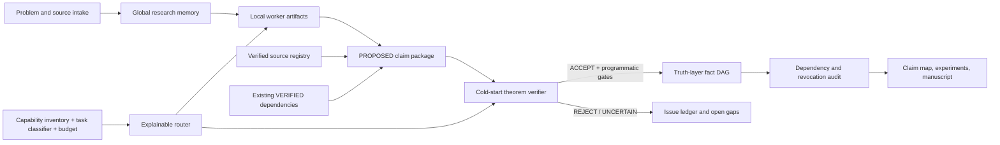
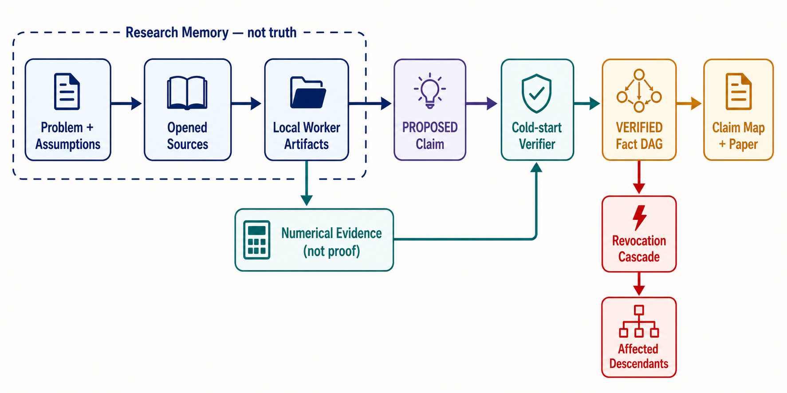

# ProofWeave architecture and implementation record

## Definition of done

The repository is usable when a new research problem can be initialized,
sources and claims can be registered, only an independent verifier can promote
claims, cycles and invalid dependencies are rejected, revocation cascades,
experiments and manuscript claims are checked, routing decisions are
reproducible and secret-free, the isolated toy project passes, and the full
release check exits successfully.

## Architecture

This generated reader-oriented companion has no evidentiary role; the code and
schemas define the actual gates.

## State boundaries

1. **Truth layer** — `state/fact_graph.jsonl`; only VERIFIED facts may support
   formal manuscript claims or downstream proposed proofs.
2. **Global research memory** — problem, assumptions, notation, plan, decisions,
   gaps, dead ends, literature notes and status.  It may contain hypotheses but
   cannot promote them.
3. **Local worker memory** — `research/workers/` and scratch/experiment artifacts.
   It is disposable evidence-generation context and never the source of truth.

## Main components

- `mathlab.fact_graph`: DAG invariants, independent-verifier promotion,
  dependency closure and append-preserving revocation cascade.
- `mathlab.source_registry` and `mathlab.issue_ledger`: validated JSONL records
  with explicit lifecycle states.
- `mathlab.validation`: project, experiment, bibliography, claim-map and release
  gates.
- `mathlab.capability_probe`: passive, secret-free executable/version/auth-state
  detection; paid probes are disabled by default.
- `mathlab.task_classifier`, `model_registry`, `reasoning_router`,
  `model_router`, `budget_manager`, `routing_audit`: deterministic classification,
  hard filters, normalized scoring, bounded escalation and auditable fallback.
- `mathlab.providers`: real capability/dry-run adapters.  Unconfigured API and
  gateway adapters raise explicit errors instead of acting as empty support
  claims.
- `agents/` and `workflows/`: canonical model-independent contracts.
  `.codex/` and `.claude/` contain thin native adapters that point back to these
  files, so role rules have one source.

## Current execution-mode decision

Primary mode for this initialization: **MODE A — NATIVE_MULTI_MODEL**.

Evidence: the current Codex desktop session exposes native subagents, per-agent
model selection, per-agent reasoning effort, web/tool calls, shared workspace
files, steering and waiting.  This is a host-session capability, not a promise
about every future account or CLI invocation.  The generated inventory records
the exact evidence and check time.

Secondary capability: Codex CLI 0.142.2 and Claude Code 2.1.193 are installed;
both document model selection, and Claude Code documents `--effort`.  CLI
subprocess routing remains disabled until `allow_cli_subprocess_agents` is set,
because invoking another model may consume plan or provider quota.  No provider
API key was present and no paid probe was made, so API and gateway modes are not
active.

## Implementation sequence

1. Establish source basis and passive capability snapshot.
2. Create schemas, canonical agent/workflow contracts and safe defaults.
3. Implement truth-layer invariants and registries with standard-library Python.
4. Implement passive capabilities, task/reasoning/model routing, budgets,
   benchmarks and provider gates.
5. Expose commands through `python -m mathlab` and thin validation scripts.
6. Run an isolated odd-number-sum workflow including an accepted proof, a
   deliberately rejected proof, claim map and LaTeX build.
7. Run six dry routing demonstrations without external model calls.
8. Run unit tests, schema/project validation, LaTeX compilation when available,
   secret scan and final release check.

## Threat and cost posture

- No real `.env`, tokens, cookies or account data are written.
- No model catalog entry becomes executable without host/account evidence.
- No paid probes, model API calls, uploads, pushes or publications occur during
  initialization.
- Parallelism and repair/escalation loops are bounded by configuration.
- Web/MCP output is untrusted input; citations require an opened source and an
  entailment note.
- `VERIFIED` never means human peer review, and machine-checked proof is claimed
  only after a pinned formal build with no disallowed axioms/placeholders.
